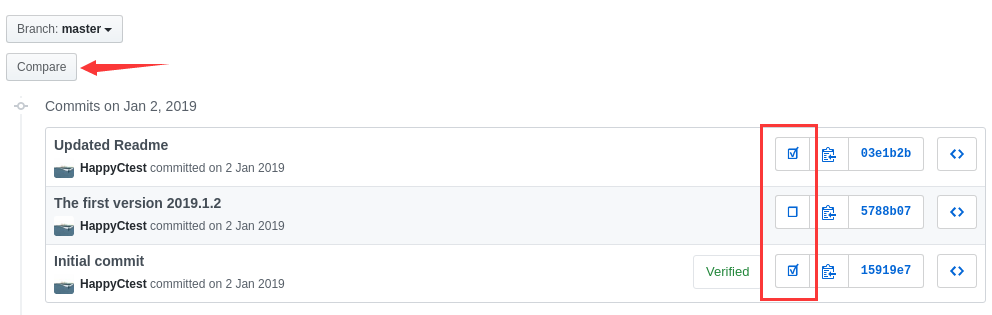

# Github-Show-Diff

## Intro

这是一个油猴脚本，可以方便的比较Github上任意两个Commit之间的差异，用Github漂亮直观的方式展现出来。 

Tempermonkey script: A tool to compare arbitary two commits on Github, and present the differences in a beautiful and intuitive way.

## Usage

1. 安装油猴脚本浏览器插件，从[这里](https://openuserjs.org/scripts/HappyCtest/Github-Show-Diff)安装Github-Show-Diff脚本。

   Install Tempermonkey, the browser plugin. And Install the Github-Show-Diff script from [here](https://openuserjs.org/scripts/HappyCtest/Github-Show-Diff).

2. 打开你的Github repo，点击“X Commits”进入提交浏览界面。

   Open your Github repo, and click "X Commits" to see your commits.

3. 勾选你想比较的两个commit，并点击上方的“Compare”按钮。

   Check two commits you want to compare, and click the "Compare" button.

   

## Problems

- 界面太丑

  没有html/CSS基础，后期有时间再改进吧，~~又不是不能用~~（不是。。。

- 不能选择分在两页的提交

  确实是个问题，毕竟这是初版嘛，之后改进吧。要是有这个需求，可以尝试[手动操作](https://blog.csdn.net/HappyCtest/article/details/104520274)。

- 其他功能

  预计之后加以下功能：

  - 分布在两页上的commit比较
  - 定位到某一个文件的比较
  - ……

>  **这个工具完全是写着好玩来着，欢迎一起交流和改进。**